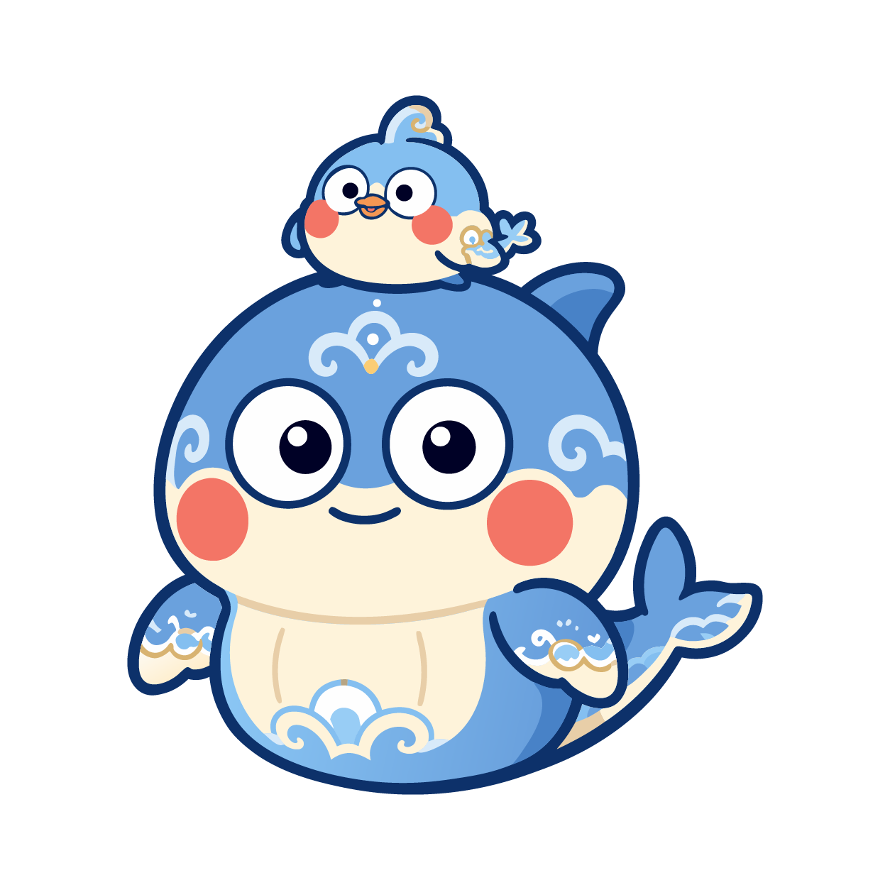

<p align="center">
  
</p>

<h1 align="center">Kun — a local-first AI agent workbench</h1>

<p align="center">
  Plan, execute, verify, and deliver real work with AI.<br>
  The desktop GUI and terminal TUI share one local runtime, so tasks, approvals, plans, and evidence stay connected.
</p>

<p align="center">
  <a href="https://github.com/KunAgent/Kun/releases">Download desktop app</a>
  &nbsp;·&nbsp;
  <a href="https://www.kun-agent.com/docs">Documentation</a>
  &nbsp;·&nbsp;
  <a href="https://github.com/KunAgent/Kun">GitHub</a>
  &nbsp;·&nbsp;
  <a href="./README.md">中文</a>
</p>

<p align="center">
  <a href="https://github.com/KunAgent/Kun/releases"></a>
  <a href="./LICENSE"></a>
  
  
</p>

<p align="center">
  
</p>

## What is Kun?

Kun is a local-first workbench that moves AI from answering questions to finishing work. It organizes real work into two primary modes: Code for shipping software, with a Design canvas available inside the same task; and Work for writing, organizing source material, analyzing documents, and producing presentations. Agents can read workspace context, make plans, use tools, change files, run checks, and keep the evidence next to the task.

The desktop GUI is for seeing, reviewing, and controlling the work. The terminal TUI is for staying in a keyboard-first flow. Both connect to the same local `kun serve` runtime and share threads, goals, plans, approvals, and background work instead of creating disconnected histories.

## At a glance

| Need | Kun provides |
| --- | --- |
| Build, debug, and ship software | Code mode provides project context, file editing, terminal, Git / Worktree, diffs, tests, and review. |
| Move from a brief to an implementable design | Switch to the Design canvas inside the same Code task to develop prototypes, design systems, and Design → Code context. |
| Write, organize, and handle everyday tasks | Work mode can edit Markdown, preview, quote, and analyze PDF / Office documents, analyze spreadsheets, and turn outlines into presentations; Office files remain read-only. |
| Automate repeated work | Scheduled tasks, Loops, Hooks, MCP, Skills, and installable extensions. |
| Choose how to connect a model | Subscriptions, plans, APIs, OpenAI / Anthropic-compatible services, and self-hosted models through Provider settings. |

## Current interface

Every screenshot below was recaptured through browser automation with an ephemeral, isolated app profile and demo workspace. No real project, account data, personal settings, or conversation history is shown.

### Code: build, debug, and ship

Code mode keeps the project, branch, Code / Design task entry points, and task composer in one workbench. Use it to read and change code, run terminals and tests, inspect diffs, and move into the Design canvas when the task needs a visual solution.

<p align="center">
  
</p>

### Work: write, organize, and handle everyday tasks

Work mode brings together a workspace file tree, task starters, and the Work assistant for document-oriented work. Draft Markdown, summarize or ask about documents, analyze spreadsheets, create presentations, or use a whiteboard to organize ideas.

<p align="center">
  
</p>

## From goal to acceptance

```text
Clarify the goal → make a plan → execute and collaborate → inspect evidence → deliver or continue
```

1. **State the goal and constraints.** The agent uses project context to surface scope, risks, and acceptance criteria.
2. **Execute the plan step by step.** Change files, use tools, and verify progress within the task scope; adjust the plan when the requirement changes.
3. **Work in visible context.** Plans, Todos, tool calls, file changes, browser/terminal output, and approvals remain associated with the task.
4. **Deliver with evidence.** Review diffs, tests, reviews, and artifacts; continue, fork, archive, or replan when the requirement changes.

Requirements and plans can live in the project by default, which makes them versionable, reviewable, and easy to resume.

## Local-first does not mean never connected

Sessions, preferences, logs, and runtime data are stored locally by default. When you use a cloud model, prompts, attachments, and task context are sent to the selected Provider; review that service's data policy before use. Tool permissions, sensitive actions, and extension permissions are made visible in the app, and you decide whether to authorize them.

Kun is not tied to one model vendor. Presets cover ecosystems including ChatGPT / Codex, Claude, Gemini, Cursor, Ollama, DeepSeek, Kimi, GLM, Qwen, MiniMax, and Xiaomi MiMo. Sign-in methods, available models, regions, and quotas depend on the current release and Provider rules; see [model provider presets](docs/model-provider-presets.md) for configuration details.

## Get started in 5 minutes

Download the current release from [GitHub Releases](https://github.com/KunAgent/Kun/releases):

| Platform | Installer | Architecture |
| --- | --- | --- |
| macOS | `.dmg` / `.zip` | Apple Silicon / Intel |
| Windows | `.exe` | x64 |
| Linux | `.AppImage` / `.deb` | x64 |

Then:

1. Pick a language and configure a model subscription, plan, API, or custom Provider.
2. Open a local project or create a workspace.
3. Send a clear, bounded task with a way to verify the result.

The desktop app and TUI can connect to the same runtime at the same time. Run this in a project directory:

```bash
kun
```

Starting with 0.3.8, standalone TUI archives are no longer distributed; use the terminal commands bundled with the desktop app. See the [Kun TUI guide](docs/kun-tui.en.md) for commands and configuration.

## Run from source

Requirements: Node.js 22.19+, npm, and at least one usable model connection.

```bash
git clone https://github.com/KunAgent/Kun.git
cd Kun
npm ci
npm run dev
```

| Command | Purpose |
| --- | --- |
| `npm run dev` | Build the runtime and start Electron development |
| `npm run dev:tui` | Build the runtime and start the terminal TUI |
| `npm run typecheck` | Run TypeScript type checks |
| `npm run lint` | Run ESLint and the file-size check |
| `npm run test` | Run tests |
| `npm run build` | Create a production build |
| `npm run dist:mac` / `dist:win` / `dist:linux` | Build platform installers |

For slower npm access in mainland China:

```bash
npm ci --registry=https://registry.npmmirror.com
```

## Documentation and contributing

| Topic | Guide |
| --- | --- |
| TUI, commands, and runtime | [docs/kun-tui.en.md](docs/kun-tui.en.md) / [kun/README.md](kun/README.md) |
| Design workflow | [docs/DESIGN_MODE.md](docs/DESIGN_MODE.md) |
| Loops, MCP, and Skills | [docs/workflow-loop.en.md](docs/workflow-loop.en.md) / [docs/project-mcp-skills.md](docs/project-mcp-skills.md) |
| Extension platform | [docs/extensions/README.en.md](docs/extensions/README.en.md) |
| Local development | [docs/DEVELOPMENT.en.md](docs/DEVELOPMENT.en.md) |

Contributions to bug fixes, UI/UX, runtime behavior, Providers, extensions, and documentation are welcome. `develop` is the integration branch; target pull requests at `develop`. Read the [contribution guide](docs/CONTRIBUTING.en.md) first, and accept the [CLA](./CLA.md) for external contributions.

## License

Kun uses the [PolyForm Noncommercial License 1.0.0](./LICENSE) for learning, research, and noncommercial use. Commercial use, distribution, SaaS/hosting, resale, or integration into a commercial product requires separate written authorization from the author.

## Acknowledgements

Thanks to everyone who contributes issues, ideas, code, and documentation.

Kun's memory architecture research draws on the public Thread/Memory separation, provenance, and hybrid-retrieval concepts documented by [Nowledge Mem](https://mem.nowledge.co/docs); Kun's implementation remains independent and follows its own single-runtime, local-first architecture.

<a href="https://github.com/KunAgent/Kun/graphs/contributors">
  
</a>
