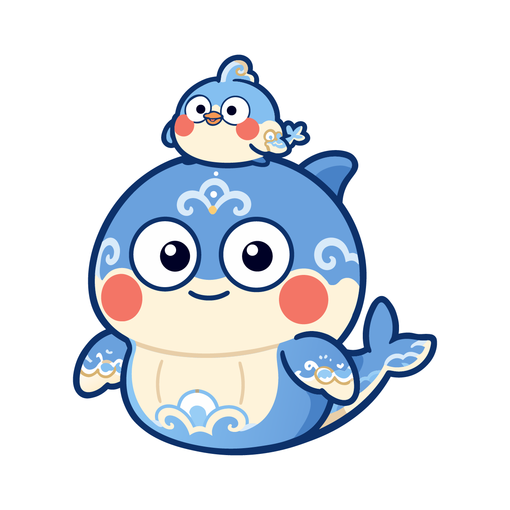

<p align="center">
  
</p>

<h1 align="center">Kun — your local-first personal AI assistant</h1>

<p align="center">
  Manage goals, knowledge, tasks, and your AI team on your own computer.<br>
  Stay in touch with a personal Agent, collaborate in Rooms, and get work done in Code / Work.
</p>

<p align="center">
  <a href="https://github.com/KunAgent/Kun/releases">Download desktop app</a>
  &nbsp;·&nbsp;
  <a href="https://www.kun-agent.com/docs">Documentation</a>
  &nbsp;·&nbsp;
  <a href="https://github.com/KunAgent/Kun">GitHub</a>
  &nbsp;·&nbsp;
  <a href="./README.md">中文</a>
</p>

<p align="center">
  <a href="https://github.com/KunAgent/Kun/releases"></a>
  <a href="./LICENSE"></a>
  
  
</p>

<p align="center">
  
</p>

## What is Kun?

Kun is a personal AI assistant that runs on your computer and helps you manage work from an initial idea to a finished result. Start with “help me move this forward”: a personal Agent can clarify the goal, organize source material, remember relevant preferences, track commitments, and move into a document or code workspace when needed. Progress, decisions that need you, and deliverables stay connected to their context.

One person can work with an AI team with clear responsibilities. Talk privately with an Agent, bring several Agents into Rooms to discuss a plan, and let authorized executors handle the work. You decide what they can access, what they can do, and when to accept or apply a result.

### One workflow, complementary entry points

| Entry point | What it does for you |
| --- | --- |
| **Personal Agents** | Everyday conversation and follow-through, with a persistent identity, private chat, personal workspace, and manageable memory. Code's Conversations section and Rooms open the same private chat. |
| **Rooms** | Bring Agents together around a topic. Keep discussion, responsibilities, project agreements, execution tasks, and review in one collaboration space. |
| **Code + ADE** | Execute and deliver software tasks. Code provides projects, terminals, Git / Worktrees, diffs, and a Design canvas; ADE's Agent connections and collaboration are integrated into Code. |
| **Work** | Work with knowledge and documents. Draft Markdown; preview, quote, and analyze PDF / Office documents; analyze spreadsheets, edit supported XLSX content, create presentations, or organize ideas on a whiteboard. |

A personal Agent is an identity you keep talking to; the execution Agent selected in Code runs a particular development task. Each has its own configuration and permissions. Start with one Agent and one concrete task, then add a team or a specialized workspace when useful.

> This README describes the `develop` branch. Features in downloaded builds depend on the release; ADE collaboration still requires an experimental feature switch, and external Agents and connected apps have their own setup requirements.

## Personal Agents: conversation with follow-through

Create a general assistant or choose Agents with research, design, development, and review responsibilities. Define an Agent through a conversation, fill in its profile, or start from a template.

- **Keep useful context.** Each Agent has its own private chat, workspace, and run history. Everyday knowledge work does not require a Git repository; you can also explicitly connect a local folder.
- **Manage its memory.** Inspect sources, correct, disable, forget, or explicitly share memories. Memory is scoped to the Agent and source; it is not automatically open to every Agent and cannot grant permission.
- **Track work to an outcome.** Agents can record commitments, deadlines, blockers, and acceptance evidence, schedule one-off or recurring reminders, and bring background results back to the original conversation.
- **Move into a workspace when needed.** Depending on an Agent's Code / Work access policy, it can propose code tasks, document tasks, or document edits. Task cards keep status, approvals, results, and workspace links together; you can open the target session and take over.

The default workbench access policy is **ask first for Code, read-only for Work**. To let an Agent create or edit Work content, choose the appropriate policy under its **Code & Work access** settings first.

## Rooms: discussion, responsibilities, and delivery together

When a task benefits from different perspectives, bring the relevant Agents into a group conversation. Discussion can start without a repository. For repository execution, bind a local Git repository and authorize the appropriate members.

- **Choose how to collaborate.** In peer discussion, members decide whether they have something new to contribute. Coordinator mode assigns work; directed collaboration focuses on @-mentioned members or the default responder.
- **Make agreements explicit.** Only content you pin becomes a project agreement. Tasks retain the agreement versions they started with, and later changes remain traceable.
- **Turn a suggestion into a reviewable task.** Agents can propose execution, new members, or pinned agreements through cards that you adopt or dismiss.
- **Separate delivery from acceptance.** Rooms repository tasks run in isolated Git worktrees. A delivery is pinned to a specific version before a designated Reviewer checks it. Diffs, declared checks, logs, and review results stay with the task; accepting delivery and applying code are separate actions.

Rooms is a collaboration space for you and your Agents. Discussion, history, and another Agent's suggestions do not automatically authorize new execution.

## Code + ADE: choose how a task gets done

ADE's capabilities are integrated into the Code workbench, so everyday development starts from the same project and task entry points. Use Kun, or configure an external Agent such as Claude Code, Codex, Gemini CLI, Cursor, or Devin. Available models, permissions, and tools depend on each Agent's capabilities and sign-in state.

- **Choose the execution Agent in the composer.** Use the Agent menu in the original Code / Design position; model sources and models retain their own menu.
- **Enable collaboration when useful.** With the ADE experimental feature enabled, a Kun task can use “+ → Use collaboration” to split work, dispatch workers, and follow results. Collaboration defaults, team limits, and budgets are configurable in settings.
- **Review and take over in the existing workspace.** Inspect workers in the collaboration panel and diffs, checks, and review information in Changes. Workspace, permission, and version boundaries remain in place.
- **Keep design connected to code.** Kun's Design canvas supports prototypes, design systems, and Design → Code context. Kun-specific Design, Graph, and plan workflows require the Kun execution Agent.

External Agents need their corresponding programs, accounts, or model sources. Use the app's detection and trial-run results to check readiness; an available adapter is not a guarantee that every account or network has been verified. See [Code and ADE integration](docs/ade/14-code-workbench-integration.md) for configuration and implementation details.

## Three things to try

| Scenario | Start with | Review the result |
| --- | --- | --- |
| Organize the week's work | Give a personal Agent a local note: “Extract the tasks, deadlines, and questions that need my decision.” Specify a time if you want a reminder. | Review tasks and results in the private chat; set reminders as needed. |
| Turn source material into a useful document | Open the material in Work: “Draft a proposal from these sources and flag missing information.” You can also authorize a personal Agent to start a Work task. | Inspect the document in Work and continue from its task card. |
| Deliver a software change | Discuss scope in Rooms with a developer and reviewer, then authorize execution on a chosen repository; or start a task directly in Code. | Inspect the pinned delivery, diff, checks, and review before deciding to apply it. |

These are example tasks. Accessible sources and executable steps depend on the models, tools, and permissions you configure.

## Get started

Choose a release from [GitHub Releases](https://github.com/KunAgent/Kun/releases):

| Platform | Installer | Architecture |
| --- | --- | --- |
| macOS | `.dmg` / `.zip` | Apple Silicon / Intel |
| Windows | `.exe` | x64 |
| Linux | `.AppImage` / `.deb` | x64 |

1. **Connect a model.** Pick a language and configure a usable model subscription, plan, API, or custom Provider. See [model provider presets](docs/model-provider-presets.md).
2. **Start a private conversation.** In Code's Conversations section or Rooms, create a conversation with an existing or new personal Agent. Give it a concrete goal and the necessary material; you do not need a team or code project first.
3. **Check its access.** Review the Agent's permissions, working directory, and Code / Work access policy. Try one complete task with the default approval settings.
4. **Use the workspace the task needs.** Work handles documents, Code handles software, and Rooms brings multiple perspectives together. For ADE collaboration, enable it under Settings → Laboratory → ADE, then configure Settings → Assistant → Agent connections / Collaboration.
5. **Inspect the outcome.** Review artifacts, sources, changes, and checks. Resolve anything that needs your decision or ask for the next step.

For terminal work, the GUI and TUI can share threads, plans, and approvals through the local `kun serve` runtime. Keep the desktop app running and explicitly attach to its runtime from a project directory:

```bash
kun --no-start
```

To use the TUI on its own, quit the desktop app using the same profile first, then run `kun`. The default TUI starts its own runtime and stops it on exit.

Starting with 0.3.8, standalone TUI archives are no longer distributed; use the terminal commands bundled with the desktop app. See the [Kun TUI guide](docs/kun-tui.en.md) for commands and configuration.

## Local-first and operating boundaries

- **Data is local by default.** Conversations, Agent memories, preferences, logs, and runtime data are stored on your computer. Cloud models receive prompts, attachments, and relevant context through the selected Provider. Connected apps, MCP servers, and external Agents may also communicate with their services; review their data policies.
- **Choose a model independently of your work.** Kun supports OpenAI / Anthropic-compatible services and self-hosted models, with presets for DeepSeek, Ollama, Kimi, GLM, Qwen, and other ecosystems. Subscriptions, model availability, regions, and quotas follow each Provider's current rules.
- **Permissions define what can happen.** Tool and directory permissions, approvals, and extension permissions constrain actions. Memory, reminders, team discussion, and navigation do not expand authority; new personal private chats default to asking for approval.
- **Background work needs a running computer.** By default, closing the desktop main window quits the app and stops its managed work. Reminders and background tasks require Kun to run and the computer to stay awake; online tasks also need a network connection. An optional independent host must be explicitly started with `kun host start` and cannot own the same profile alongside the default GUI. See [runtime ownership and lifecycle](docs/rooms-persistent-host.md).
- **Check connected-app readiness.** MCP, Skills, Hooks, Loops, scheduled tasks, and extensions can add capabilities. Google Workspace is currently **Experimental / Developer Preview** and needs user-managed Google Cloud and OAuth setup. Gmail / Calendar writes require per-action approval; Drive is read-only. See [integration scope and setup](docs/google-workspace-cli.md).

## Code and Work interface examples

These existing repository assets show Code and Work using isolated demo data. They are not new screenshots of every current entry point and contain no real project, account, or conversation data.

### Code: projects, tasks, and changes

<p align="center">
  
</p>

### Work: sources, documents, and output

<p align="center">
  
</p>

## Run from source

Requirements: Node.js 22.19+, npm, and at least one usable model connection.

```bash
git clone --branch develop https://github.com/KunAgent/Kun.git
cd Kun
npm ci
npm run dev
```

| Command | Purpose |
| --- | --- |
| `npm run dev` | Build the runtime and start Electron development |
| `npm run dev:tui` | Build the runtime and start the terminal TUI |
| `npm run typecheck` | Run TypeScript type checks |
| `npm run lint` | Run ESLint and the file-size check |
| `npm run test` | Run tests |
| `npm run build` | Create a production build |
| `npm run dist:mac` / `dist:win` / `dist:linux` | Build platform installers |

For slower npm access in mainland China:

```bash
npm ci --registry=https://registry.npmmirror.com
```

## Documentation and contributing

| Topic | Guide |
| --- | --- |
| TUI, commands, and runtime | [docs/kun-tui.en.md](docs/kun-tui.en.md) / [kun/README.md](kun/README.md) |
| Personal Agents, memory, and conversations | [docs/independent-agents.md](docs/independent-agents.md) / [docs/code-agent-chats-and-rooms.md](docs/code-agent-chats-and-rooms.md) |
| Personal Agent / workbench hand-offs | [docs/rooms-workbench.md](docs/rooms-workbench.md) |
| Code and ADE collaboration | [docs/ade/14-code-workbench-integration.md](docs/ade/14-code-workbench-integration.md) |
| Reminders and background operation | [docs/rooms-reminders.md](docs/rooms-reminders.md) / [docs/rooms-persistent-host.md](docs/rooms-persistent-host.md) |
| Design workflow | [docs/DESIGN_MODE.md](docs/DESIGN_MODE.md) |
| Rooms multi-agent collaboration | [docs/rooms.md](docs/rooms.md) |
| Loops, MCP, and Skills | [docs/workflow-loop.en.md](docs/workflow-loop.en.md) / [docs/project-mcp-skills.md](docs/project-mcp-skills.md) |
| Extension platform | [docs/extensions/README.en.md](docs/extensions/README.en.md) |
| Local development | [docs/DEVELOPMENT.en.md](docs/DEVELOPMENT.en.md) |

Contributions to bug fixes, UI/UX, runtime behavior, Providers, extensions, and documentation are welcome. `develop` is the integration branch; target pull requests at `develop`. Read the [contribution guide](docs/CONTRIBUTING.en.md) first, and accept the [CLA](./CLA.md) for external contributions.

## License

Kun uses the [PolyForm Noncommercial License 1.0.0](./LICENSE) for learning, research, and noncommercial use. Commercial use, distribution, SaaS/hosting, resale, or integration into a commercial product requires separate written authorization from the author.

## Acknowledgements

Thanks to everyone who contributes issues, ideas, code, and documentation.

Kun's memory architecture research draws on the public Thread/Memory separation, provenance, and hybrid-retrieval concepts documented by [Nowledge Mem](https://mem.nowledge.co/docs); Kun's implementation remains independent and follows its own single-runtime, local-first architecture.

<a href="https://github.com/KunAgent/Kun/graphs/contributors">
  
</a>
