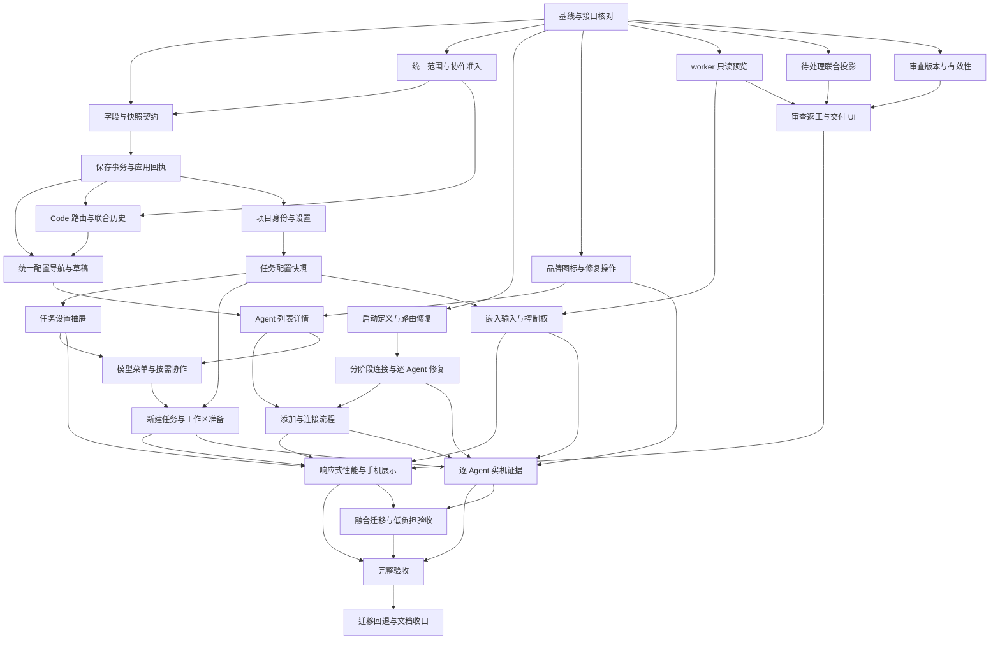

# Code 融合工作台与配置完整实施计划

本文是执行入口。范围包括统一配置、项目和任务设置、任务创建、worker 查看与控制、待处理及审查交付。所有批次目前均未实施；代码中已经存在的底座只做验证、接入和必要扩展。

2026-09-30 修订：用户要求 ADE 与 Code 深度融合为同一页面。以 [融合设计](../../14-code-workbench-integration.md) 为产品正本；U01-U04 补齐统一路由、历史、准入和低负担交互，旧独立页面方案不再实施。

## 1 交付文件与使用方式

| 文件 | 用途 |
| --- | --- |
| [proposal.md](proposal.md) | 目标、范围、能力边界 |
| [design.md](design.md) | 架构决策、基线、迁移与风险 |
| [configuration-ui.md](configuration-ui.md) | 入口、容器、字段、交互和文案规则 |
| [contracts.md](contracts.md) | 正本、覆盖、生效、版本、接口 |
| [acceptance.md](acceptance.md) | 正常/失败/恢复/跨端验收矩阵 |
| [agent-connectivity.md](agent-connectivity.md) | 截图所示 Agent 接入故障、接入机制、品牌图标和 B01-B04 修复 |
| [tasks.md](tasks.md) | 按批次执行的勾选清单 |
| [specs/](specs/) | 八个能力的规范性需求与场景 |

每批开始先读目标、依赖和验收，确认相关用户改动已经纳入基线。完成代码与验证后才勾选 tasks。文档存在或 OpenSpec 显示 apply-ready 不表示产品实现完成。

## 2 范围与优先级

第一优先级是 Agent 实际接入与配置正确性；其次是入口、品牌和主任务/worker 上下文；随后完成验收和合入闭环。用户截图新增的 B01-B04 是必做范围，不能仅交付 UI。

首版必须完成全局、项目、任务三种作用域和下一轮覆盖的真实语义。允许分批发布入口，但不能把未接后端的设置按钮作为已完成交付。

不新增：外部 agent 引擎、任意分屏编辑器、远程执行平台、赛马系统、Graph 编辑器、收费来源或按币种预算。已有能力保持兼容，可按需继续进入。

## 3 依赖图

图中的独立分支表示代码依赖，不要求或授权自动启动额外 agent。单人按拓扑顺序执行即可。

## 4 分批总表

S 为局部改动，M 为跨组件/服务改动，L 为涉及存储或执行生命周期的改动。规模用于排期，不是完成证据。

| 批次 | 内容 | 规模 | 区域 | 退出标准 |
| --- | --- | --- | --- | --- |
| A01 | 基线、现有改动与契约清点 | S | 全层只读/必要回归 | 明确已有、待接入和新开发 |
| A02 | 字段归属、解析和兼容契约 | M | shared/kun | 白名单与来源解析测试通过 |
| A03 | 条件保存、草稿提交、应用回执 | L | main/preload/settings | 并发与迟到回执不丢配置 |
| A04 | 唯一配置入口及草稿返回 | M | renderer | 所有深链到同一实现 |
| A05 | Agent 列表、详情和来源选择 | M | renderer/shared | 配置对象与 route 一致 |
| A06 | 添加、连接和修复流程 | L | renderer/main/kun | 安装/登录/检查可完成和恢复 |
| A07 | 项目身份与两类配置 | L | main/shared/renderer | 本机与仓库设置各自正确保存 |
| A08 | 任务设置快照及生效时机 | L | kun/shared/runtime bridge | 已有轮次不被默认值修改污染 |
| A09 | 当前任务设置抽屉 | M | renderer | 来源、pending、生效值准确 |
| A10 | 新任务与工作区流程 | M | renderer/kun | 创建到发送有幂等与恢复 |
| A11 | worker 就地只读预览 | M | renderer | 主会话/草稿/滚动不变化 |
| A12 | 嵌入输入、队列、接管交还 | L | renderer/kun | 发送和控制权不串线程 |
| A13 | 待处理与状态投影 | M | shared/kun/renderer | 已读、结束、验收、失败分离 |
| A14 | 成果版本与验收有效性 | L | kun/shared | 新改动使旧结论过期 |
| A15 | 审查、返工和合入流程 | L | renderer/kun | 批注到返工到交付可闭环 |
| A16 | 布局、性能与手机展示 | M | renderer/main | 多任务与多端显示可用 |
| A17 | 自动化与真实执行验收 | M | tests/scripts | 失败恢复、平台、真实 agent 有证据 |
| A18 | 迁移、回退和文档收口 | M | 全层 | 升级保留数据，回退路径验证 |

B01-B04 的步骤见接入专项。U01-U04 的步骤见融合设计 §13。U01 在 A02/A08 前，U02 在 A04/A10 前，U03 在 A10 前，U04 在 A17 前；B01/B02/B03/B04 的依赖保持。共 26 个交付批次。

## 5 A01 基线与既有工作接入

**依赖：** 无。

1. 运行 `git status --short --branch`，记录 HEAD 与相关文件 diff，不重置用户修改。
2. 核对 `adeDraftOpen`、`AdeStage`、workbench starters、navigation actions、发送快照和附件处理。
3. 在当前基线上运行相关已有测试，分开记录既有失败和新失败。
4. 核对 P5/P6 已实现能力、settings 自动保存及 strict schema、TeamStore/ThreadStore 正本写入路径。
5. 检查所有即将扩展文件的行数，接近 700 行时把抽取安排在对应 PR 的前半。

**代码入口：** `components/ade/AdeStage.tsx`、`components/workbench/use-workbench-chat-starters.ts`、`store/chat-store-ade-send-snapshot.ts`、`store/chat-store-send-composer-selection.ts`，以及对应测试。

**验收：** 新建草稿不会显示成总览；route/模型/项目在异步发送中冻结；不把现有未提交工作列为“从零实现”。

**回退：** 本批只记录和补必要的回归证据，不移动工作区或修改历史。

## 6 A02 设置字段、来源与兼容契约

**依赖：** A01、U01。

1. 在 `src/shared` 和 `kun/src/contracts` 定义 contracts 中的有限字段集、对象类型、origin、snapshot 和 mutation/result schema。
2. 增量扩展 `app-settings-types-kun-runtime.ts`、`app-settings-types-kun-services.ts`、`app-settings-kun-harness.ts`。
3. 建立纯解析器 `resolveAdeSettings`（建议名），输入已验证默认和覆盖，输出 resolved + origins + warnings。
4. route 原子校验，权限继续调用宿主/运行时授权机制；不把未知字段送入 runtime。
5. 同步 IPC strict schema、Main config 生成、Kun config schema/sanitize 和公开脱敏投影。

**测试：** 缺字段兼容、set/unset、非法字段、无兼容来源、权限不扩大、同一输入重复生成配置字节一致。

**验收：** 不增加新 UI 时 Code 和已有 ADE 行为不变；新字段有明确 owner 和生效边界。

**回退：** 新字段可选，关闭新界面不清理数据。

## 7 A03 条件保存与 runtime 应用

**依赖：** A02。

1. 按 contracts 选择扩展现有保存入口或新增 `settings:apply-ade-patch` 薄封装，禁止并存两套写入规则。
2. 在现有串行保存临界区完成 revision 校验和对象级 patch；旧 `settings:set` 保持兼容。
3. 复用 Main intent sequencer，回执同时携带对象 revision 和应用 generation。
4. 增加 ADE 独立草稿提交 controller，不把未提交编辑送进 450ms 自动保存或离页 flush。
5. 复用既有保护设置授权、凭据脱敏和 Service Manager 写入通道。

**代码入口：** `src/main/ipc/register-app-settings-ipc-handlers.ts`、`src/preload/index.ts`、`src/main/runtime/runtime-settings-intent-sequencer.ts`、`src/main/main-runtime-settings.ts`、`components/use-settings-persistence.ts`。

**测试：** 两窗口编辑同一 Agent、不同 Agent 并发、已保存未应用、旧应用结果晚到、runtime 离线、保存中关闭页面、保护字段拒绝。

**验收：** 失败保留草稿；只重试应用不重写旧设置；不影响其他设置现有自动保存。

**回退：** 保留原保存入口；新编辑入口可关闭，已保存值仍可读。

## 8 A04 配置导航与草稿工作区

**依赖：** A03、U02。

1. 添加 typed Agent 设置 target 和返回上下文；原 `AdeSettingsTarget` 可保留兼容别名。
2. 复用 SettingsView 的助手 Agent 接入/协作页签；模式菜单的 Agent 深链和旧 Harnesses 路由使用同一 target，不新增 ADE 类别。
3. 按 scope/object 管理草稿，切换对象或去 Providers 保留草稿；真正离开时处理未保存内容。
4. 迁移实验室常用字段入口，保留总开关；不能通过“移动控件”改变默认值。
5. 添加设置返回时的 thread/panel/scroll/draft 恢复。

**代码入口：** `SettingsSidebar.tsx`、`SettingsView.tsx`、`use-settings-route-synchronization.ts`、`settings-section-agents-harnesses.tsx`、`AdeSidebar.tsx`。

**验收：** 现有设置和模型菜单深链显示同一配置；Esc/返回恢复 Code 任务；高级协作关闭不隐藏历史或原有单任务能力。

**回退：** 保留旧 section 名作为 alias；不删除旧配置字段。

## 9 A05 Agent 列表详情与模型来源

**依赖：** A04、B03。

1. 拆分 AgentCenter 为列表、详情、连接状态、默认值表单和高级连接区；复用现有 actions 与 harness store。
2. 建立“已添加”兼容投影和用户目录选择元数据；探测建议独立于已保存目录。
3. 从 `ade-composer-harness.ts` 抽取来源/模型选择公共模型，Agent 默认、one-on-one 和 composer 共用。
4. 显示完整 route、能力、来源不可用原因；去掉让用户猜 credentialMode 的表单层。
5. 启用/停用与自动选择资格分别处理，目录隐藏不影响执行准入。

**代码入口：** `AgentCenter.tsx`、`AgentCenterCard.tsx`、`agent-center-actions.ts`、`harness-store.ts`、`lib/ade-composer-harness.ts`、`AdeOneOnOneDialog.tsx`。

**验收：** 未配置 Agent 不挤占常驻列表；已有可用配置不消失；同名模型不同来源可区分；保存失败不假装换模成功。

**回退：** 新旧详情共用保存协议，不迁移凭据。

## 10 A06 添加、登录、检查和修复

**依赖：** A05、B02；复用 P5 已完成部分，不依赖尚不存在的 Registry/认证协议。

1. 引入可恢复的三步向导 controller，按 wizardId + Agent ID 保存非敏感步骤信息。
2. 接入内置定义、自定义 ACP、终端 Agent 和现有导入导出；稳定 ID 与重复完成去重。
3. 安装/登录复用现有命令预填和注册进程；从终端退出或用户返回后重新检测。
4. 已实现的原生/ACP 登录只在能力已确认时开放；取消/超时结果按 operationId 丢弃迟到回执。
5. 自定义连接指纹关联 probe/test 结果；编辑后测试过期，密码行走现有 secretRef 服务。
6. 分离 handshake 与 trial，保存未就绪时显式标注，不自动发模型消息。

**代码入口：** `agent-center-custom-form.tsx`、`terminal/terminal-open.ts`、`agent/kun-harnesses-client.ts`、`kun/src/server/routes/harnesses.ts`、现有 harness detector/probe。

**验收：** Agent 缺失、需登录、unknown、探测失败、模型为空五种状态都有下一步；失败不丢配置；终端 Agent 不进入不支持的结构化派工。

**回退：** 旧命令和手动配置仍可使用；中断向导不清理已有安装或账号。

## 11 A07 项目身份、本机偏好与仓库配置

**依赖：** A02、A03。

1. 宿主解析 canonical project identity，worktree 映射来源项目，普通目录单独建身份。
2. 实现 `ade.projectDefaults` 条件更新和读取；展示实际路径、来源以及已自定义字段。
3. 项目页拆分本机偏好和仓库环境配置，分别保存。
4. 本机共享路径复用 `worktrees.sharedPaths`；仓库 setup/checks 编辑复用 project-config 文件操作并保留 MCP/Skills。
5. 仓库文件变化展示 digest/trust 状态，复用批准流程，未批准命令不得因 UI 保存直接执行。

**代码入口：** `src/main/services/project-config-service.ts`、`kun/src/config/project-config.ts`、`settings-section-worktree.tsx`、workspace identity/path 模块。

**测试：** 同名路径、符号链接、两个 worktree、非 Git、路径缺失、配置并发修改、仓库文件不相关字段保留。

**验收：** 改项目本机模型不写 `.kun/project.json`；改仓库 checks 不覆盖 MCP；父项目与 worker 归属一致。

**回退：** 保留覆盖与仓库声明，隐藏新编辑器即可；不重写旧 project grants。

## 12 A08 任务快照与执行生效

**依赖：** A02、A03、A07。

1. 新建 ADE 线程和 team 时持久化 resolved snapshot，来源值由宿主解析。
2. 扩展现有 thread/create/turn 契约及提案任务设置接口，版本字段可选并兼容旧客户端。
3. 明确 model/route 下一轮消费、limits 下次准入、budget 累计检查，旧轮次保持不可变。
4. 队列项引用发送快照；默认值变化不改队列，编辑队列创建新的输入版本。
5. worker 快照继承总管被允许的设置，权限交集保持，用户接管不重读更宽的全局权限。
6. legacy 线程不全库迁移，首次显式修改时按已有实际值建立快照。

**代码入口：** `kun/src/contracts/threads.ts`、`turns.ts`、`ade.ts`、`kun/src/server/routes/threads.ts`、thread service、`kun/src/ade/manager-runtime.ts`、`team-budget.ts`。

**验收：** 更改全局默认不改变正在运行或排队任务；重启后 pending 配置仍有正确生效边界；不支持操作明确拒绝。

**回退：** 旧请求兼容；新客户端缺 runtime 能力时隐藏新写入入口。

## 13 A09 当前任务设置抽屉

**依赖：** A04、A08。

1. 从标题栏打开任务设置，显式传目标 threadId；复用右面板宿主和返回状态。
2. 展示 effective/pending/origin，模型、权限、团队限制分别说明时机。
3. 工作区只读，切换动作深链现有工作区流程；不以编辑输入框重写 thread.workspace。
4. 保存失败保留输入；恢复继承生成 unset；关闭再打开恢复同一对象草稿。

**代码入口：** `WorkbenchRightPanel.tsx`、`CodeRightPanelTabs.tsx`、`SessionHeader.tsx`、配置 controller（新增）、ADE client。

**验收：** 正在预览 worker 时设置目标不混淆；已生效与待生效均可见；关闭恢复原文件/Workers 面板。

**回退：** 关闭抽屉入口，快照读取和原 composer 继续兼容。

## 14 A10 新建任务和工作区准备

**依赖：** A01、A08、B01、U02、U03。

1. 使用现有 Code 新建入口，不要求先选总管/一对一；Agent 与协作进入现有菜单，保留草稿。
2. 泛化已有 `adeDraftOpen`/发送快照到统一 Code 草稿控制器，复用项目/分支 picker；不维持两个模式的草稿状态。
3. 当前选择驱动就绪检查，native-login 不依赖未开启的 gateway。
4. 准备阶段显示真实 step；首条消息匹配 workspace generation 后只释放一次。
5. 重试、取消、导航离开、迟到 ready 都以原 intent/workspace ID 处理。

**代码入口：** `AdeStage.tsx`、`use-workbench-chat-starters.ts`、`use-ade-composer-controls.ts`、`AdeWorkspaceProjectPicker.tsx`、`AdeWorktreeStartPicker.tsx`、`task-workspace-store.ts`、send snapshot 模块。

**验收：** sourceRoot 与 execution path 可区分；Git 起点失效有就地错误；非 Git 仍可本地发送；旧 Code 创建与计划 worktree 行为不变。

**回退：** 原 new-manager/one-on-one action 作为兼容入口调用同一草稿 controller。

## 15 A11 worker 原地只读预览

**依赖：** A01；可在配置链之外独立实施。

1. 定义 AdeViewContext，WorkersPanel 改为显式 managerThreadId 和 inspectedWorkerId。
2. 复用已有按 thread 读取/时间线渲染边界，实现只读 inspector，任务/对话/改动三个视图。
3. 保留全局主会话，预览不调用 selectThread，不修改主 blocks/input。
4. 完整打开记录父任务返回上下文；分别缓存滚动锚点、选中文件和历史 cursor。
5. 隐藏 inspector 停止重型消息渲染和对应 watcher，摘要订阅继续。

**代码入口：** `workers/WorkersPanel.tsx`、`WorkerRow.tsx`、`chat/LazyMessageTimeline.tsx`、`SideConversationTimeline.tsx`、workbench panel host。

**验收：** 高频切换三个 worker，不丢总管草稿/选中面板，不将预览标为接管；失败显示局部重试。

**回退：** 可以退回完整打开入口，但不宣称嵌入写入已支持。

## 16 A12 嵌入输入与控制权

**依赖：** A08、A11。

1. 抽取 ConversationScope 的发送、草稿、附件、队列与 SSE 订阅；主/嵌入视图使用同一实现。
2. composer 明确显示接收者；运行中操作按 capability 显示排队/插话/停止。
3. 复用 take-over/hand-back；“接管并发送”先等控制权回执，再按执行状态投递。
4. 控制权变化不自动停止当前轮，停止是单独显式动作，队列是否继续沿用现有语义。
5. 多窗口和手机并发回答/接管时通过服务端版本验证，重复 requestId 不重发。

**代码入口：** `chat/FloatingComposer.tsx`、thread send actions、`kun/src/ade/team-controls.ts`、`manager-worker-lifecycle.ts`、`WorkerControlBanner.tsx`。

**验收：** 两个输入框和队列互不污染；图片 localFilePath 穿过原附件链；卸载时不误终止另一线程。

**回退：** 关闭嵌入输入并保留只读预览/完整打开，已有排队记录仍按原目标执行。

## 17 A13 待处理、阅读与状态分组

**依赖：** A01；复用 ActivityStore 和已有 team/review/workspace 读能力。

1. 定义联合摘要和稳定 attention ID，执行事实继续由 ActivityStore 持有。
2. 将未读从待处理剥离，review-required 的结束由 verdict/成果状态决定，不依赖时间衰减。
3. 修正 failed 卡片动作，按 failure/question/approval/conflict 选操作。
4. 侧栏、总览、胶囊和手机共用投影；父任务聚合子状态但保留任务主线。
5. 分页/按需读取历史 dispatch，不能用 overview 最近 50 条推断旧待办已消失。

**代码入口：** `src/shared/activity-display.ts`、`activity-row.ts`、renderer activity selectors、`ade-sidebar-groups.ts`、`MissionCard.tsx`、`MissionControlView.tsx`、mobile ADE attention。

**验收：** 已读不清审批/验收；恢复未确认不显示已完成；取消与失败区分；同一待办多端只处理一次。

**回退：** 新投影开关回旧列表，服务端待办和 verdict 不被删除。

## 18 A14 成果版本与验收有效性

**依赖：** A01。

1. 定义 ReviewTarget/ReviewRevision，将目标版本关联到 checks、批注、reviewer findings 和用户 verdict。
2. 宿主建立有界内容指纹，覆盖 HEAD 之外的 staged/unstaged/untracked/删除/重命名/二进制。
3. 指纹 incomplete 或写入期间无法稳定时投影 unknown，保留上次审查证据。
4. 新内容使旧结论 stale；不覆盖历史用户 verdict，允许为新版本建立独立裁决。
5. integrate-preview 关联 source/target 版本，实际合入重检；旧接口不因新增可选字段破坏。

**代码入口：** `kun/src/contracts/review.ts`、`ade.ts`、`task-workspace.ts`、`quality-verdict.ts`、`review-request.ts`、`workspace-tasks/task-workspace-diff.ts`、integration/preview 服务。

**验收：** HEAD 不变但工作文件变更时旧通过失效；路径移动和二进制变化受覆盖；不完整扫描不放行。

**回退：** 关闭新通过/合入入口但保留只读 diff 与历史证据，不能把 stale 回退成 passed。

## 19 A15 审查、返工与交付界面

**依赖：** A11、A13、A14。

1. ReviewPanel 接受显式目标，统一扩展 Code 现有“改动”入口，旧 review tab 作为兼容 alias。
2. 增加 workspace/dispatch 范围、成果版本、测试证据来源、verdict validity。
3. 行批注保留草稿并重定位，批量发送前显示收件人/条数/目标版本；重试不重复派工。
4. 测试失败或需修改时提供返工；修复后需要针对新版本复查。
5. 合入前显示目标分支/目录和最新预检；冲突保留工作区并给恢复路径。
6. 集成结果若尚未存在，只提供各 worker 结果导航与汇总，不伪造一份合并 diff。

**代码入口：** `review/ReviewPanel.tsx`、`ReviewPrimaryAction.tsx`、`ReviewSendMenu.tsx`、`ReviewDiffBlock.tsx`、`store/review-store.ts`、task workspace integration client。

**验收：** 批注返工闭环可完成；审批通过不自动合入；PR/CI 显示对应实际目标；未提交源文件保持不变。

**回退：** 保留原 diff/历史查看，明确关闭未支持的新版提交动作。

## 20 A16 响应式、性能和多端展示

**依赖：** A06、A09、A10、A12、A15。

1. 统一主题 token 和共享组件，清理本轮新增控件里的随意颜色/重复状态映射。
2. 验证 1280/1440/1920 与 960/375/320 布局，处理长文本、IME、触摸和键盘。
3. team 请求去重、summary 精确订阅、只加载选中 transcript/diff、隐藏面板冻结渲染。
4. 手机复用状态/请求语义，保留既有审批回答；本轮不新增远程机器配置编辑。
5. 通知链接精确定位待办，查看不等于处理；关闭标签不停止任务。

**验收：** 性能预算和交互矩阵见 acceptance；未验证平台不能标通过。

**回退：** 布局偏好可重置为旧值，业务快照和请求不变。

## 21 A17 自动化与真实 agent 验收

**依赖：** A16、B04、U04。

1. 扩展 `scripts/smoke-development-ade.cjs`，保持隔离 dataDir/settings/profile。
2. 用 deterministic fixtures 覆盖断线、延迟、重复回执、冲突和能力缺失。
3. 按 B04 逐项核验截图涉及的全部 Agent；真实 Kun、一个深度适配 Agent、一个不同接入方式 Agent 是最低集成覆盖，不能替代其余公开 Agent 的验证。
4. 验证设置保存到新建任务到 worker 到批注返工到验收到合入的完整链。
5. 验证普通 Code 路径、旧 ADE 历史、关闭高级协作后的收尾、主窗口退出及进程归属。

**验收：** 报告逐项标 fixture/真实、平台、版本、通过/失败/未执行，不能以 HTTP 或组件测试替代实机界面证据。

## 22 A18 迁移、回退和文档收口

**依赖：** A17。

1. 使用旧配置、旧线程、旧 verdict 夹具完成幂等迁移和惰性读取测试。
2. 验证旧入口重定向、旧 API 客户端和旧 runtime 的能力降级。
3. 验证同版本关闭新 UI 回退；评估旧二进制写设置丢新字段的行为并提供备份恢复步骤。
4. 更新 `docs/ade/12-workbench-ui.md`、P5 状态映射、设置说明与验收记录，不误改 Code 边界。
5. 清理已无消费者的旧展示入口；仍被兼容深链使用的 alias 保留。

**验收：** 所有必做任务和 blocker 清零，有可恢复配置、历史、工作区路径；不自动开启实验功能。

## 23 每批验证与代码卫生

- 契约、设置、运行时或跨层修改：`npm run typecheck`、相关 Vitest、`npm run build`；触及 `kun/` 加 `npm run build:kun`。
- UI 修改：除定向测试外，通过实际渲染检查弹层命中、键盘、布局与主题。
- 项目批准、控制权、成果版本、合入必须有行为测试，不能只断言组件文案或 mock 调用。
- 每批 `git diff --check`，检查新增文件也不超过 700 行；不得压缩代码规避行数门禁。
- 完整 `npm run test`、lint、file-lines 在最终交付执行；已有基线失败单列，禁止称为全部通过。
- 文档单独变更至少 `git diff --check` 和 OpenSpec strict validation。
- PR target 为 `develop`，按仓库模板写 Summary/Changes/Tests；本计划不自动授权 push、PR 或合并。

## 24 排期与里程碑

按一名熟悉本仓的工程师、复用现有适配器和 UI primitives 估算，不含新增引擎和平台依赖修复：

- M1 配置可用：A01-A06，约 7-11 工程日。
- M2 作用域与任务连续性：A07-A12，约 9-14 工程日。
- M3 待处理、验收与交付：A13-A15，约 6-10 工程日。
- M4 性能、真实验收与迁移：A16-A18，约 5-8 工程日。

此前独立工作台估算为 33-53 工程日。融合后取消第二套外壳/配置中心，新增联合历史、准入和工作区迁移；U01 完成时按复用和删除的实际范围重新估算，不把 U 批次机械叠加到旧工期。功能完整性与验收门槛不降低。

M1 的可见版本必须已经使用 Code 单页面，不交付过渡的独立 ADE 页面；项目/任务编辑仍等作用域契约，验收闭环仍等成果版本。U04 和 M4 通过后才算完整交付。
