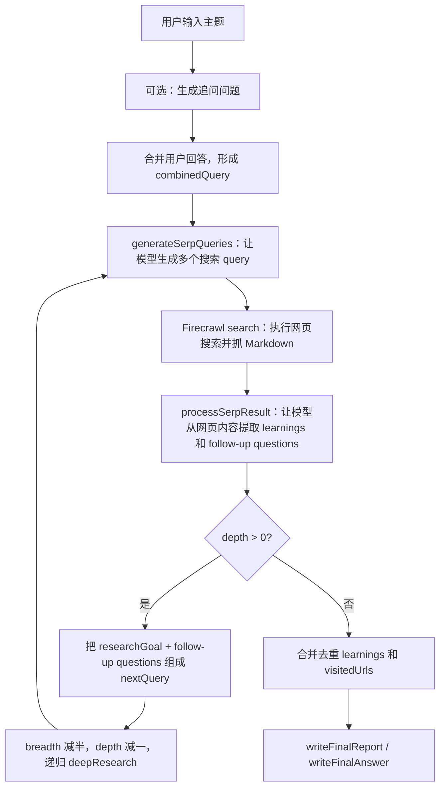
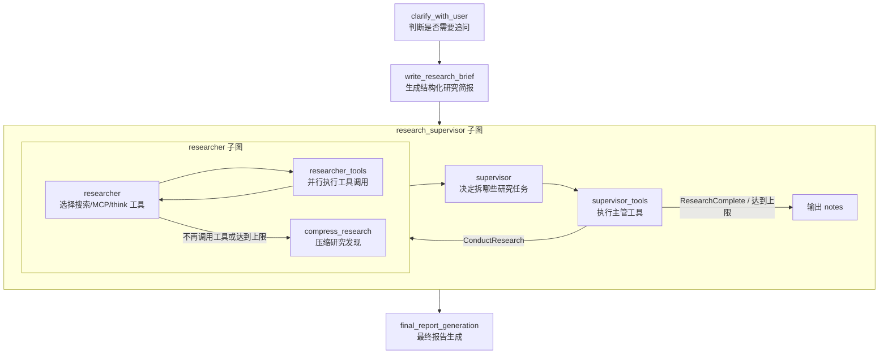

# Deep Research 实现机制说明

这份说明不是 README 翻译，而是基于本地源码阅读整理的实现拆解。重点参考：

- `repos/dzhng_deep_research/src/deep-research.ts`
- `repos/dzhng_deep_research/src/run.ts`
- `repos/open_deep_research/src/open_deep_research/deep_researcher.py`
- `repos/deep_research_from_scratch/src/deep_research_from_scratch/research_agent_full.py`

## 一句话理解

Deep Research 不是模型内部自动拥有的神秘能力，而是一个外层程序强制执行的循环：

1. 把用户问题变成更明确的研究任务。
2. 让模型生成多个搜索 query。
3. 调用搜索/网页工具拿真实材料。
4. 再让模型把材料压缩成结构化发现。
5. 根据缺口继续生成下一轮 query。
6. 循环到深度/次数上限后，用所有发现写最终报告。

模型负责“判断、生成 query、总结、写报告”；程序负责“循环、并发、工具调用、状态保存、停止条件”。

## 最小实现：dzhng/deep-research

这个项目最适合看懂核心，因为主要逻辑就在 `deep-research.ts`。



### 入口：收集问题和参数

`run.ts` 做了几件事：

- 读取用户想研究什么。
- 读取 `breadth`，即每轮生成多少个搜索 query。
- 读取 `depth`，即递归深入多少层。
- 判断用户要长报告还是短答案。
- 如果是报告模式，先调用 `generateFeedback()` 生成追问问题。
- 把原始问题和追问答案合并成 `combinedQuery`。
- 调用 `deepResearch({ query, breadth, depth })`。
- 最后调用 `writeFinalReport()` 或 `writeFinalAnswer()`。

关键点：用户看到的是“问一个问题”，代码里实际先把它变成更完整的研究 brief。

### 第一步：生成搜索 query

`generateSerpQueries()` 接收：

- 当前 query
- 本轮允许生成的 query 数量 `numQueries`
- 上一轮积累的 `learnings`

它让模型返回结构化 JSON：

- `query`：要搜索的关键词
- `researchGoal`：为什么搜这个，以及搜完之后应该往哪里深入

这里的重点不是搜索本身，而是让模型把一个大问题拆成多个可以搜索的小问题。

### 第二步：搜索和抓取网页

`deepResearch()` 用 Firecrawl 执行搜索：

- 每个 query 最多取 5 个结果。
- 抓取格式是 Markdown。
- 用 `p-limit` 控制并发，避免 API 限流。
- 每个结果会记录 URL，后面作为来源。

这一步是 grounding：把模型从“凭记忆回答”拉回到真实网页材料。

### 第三步：从网页材料提取 learnings

`processSerpResult()` 把搜索结果里的 Markdown 内容送给模型，让模型提取：

- `learnings`：信息密度高的研究发现
- `followUpQuestions`：后续应该继续研究的问题

这一步非常关键。它不是直接把网页全文丢到下一轮，而是先压缩成可继续使用的中间产物。否则上下文会爆掉。

### 第四步：递归深入

每处理完一个搜索 query，代码会计算：

- `newBreadth = Math.ceil(breadth / 2)`
- `newDepth = depth - 1`

如果 `newDepth > 0`，就构造下一轮 query：

```text
Previous research goal: ...
Follow-up research directions: ...
```

然后递归调用 `deepResearch()`。

这就是“deep”的来源：不是一次搜索很多网页，而是根据上一轮发现继续问下一轮更具体的问题。

### 第五步：合并结果并生成报告

递归结束后，系统会：

- 把所有分支的 `learnings` 合并去重。
- 把所有访问过的 URL 合并去重。
- 调用 `writeFinalReport()` 生成 Markdown 报告。
- 在报告末尾追加 `Sources` 列表。

最小版的弱点也在这里：它保存的是 learnings 和 URLs，没有更严格的“每条结论对应哪个来源”的证据账本。

## 工程实现：Open Deep Research / LangChain 版

LangChain 版不是简单递归函数，而是 LangGraph 状态机。它把 deep research 拆成几个节点：



### 为什么要加 supervisor？

最小版是“一个函数递归搜索”。这对小任务够用，但产品里会遇到这些问题：

- 用户问题可能包含多个独立方向，例如比较 3 个产品。
- 不同方向可以并行研究，节省时间。
- 每个方向需要独立上下文，避免互相污染。
- 需要有一个上层角色判断“现在够不够，可以停了吗”。

Open Deep Research 的 `supervisor()` 会绑定三个工具：

- `ConductResearch`：把一个具体主题交给子研究员。
- `ResearchComplete`：声明研究完成。
- `think_tool`：强制主管在委派前后做策略反思。

主管本身不直接搜索网页，它只负责拆任务、看结果、决定是否继续。

### researcher 子图做什么？

每个 `ConductResearch` 会启动一个独立 `researcher_subgraph`。这个子图内部是 ReAct loop：

1. `researcher` 节点让模型读当前研究主题和已有工具结果。
2. 模型决定是否调用搜索工具、MCP 工具或 `think_tool`。
3. `researcher_tools` 节点真正执行工具。
4. 工具结果作为消息喂回模型。
5. 循环直到模型不再调用工具，或达到工具调用上限。
6. 进入 `compress_research`。

这和最小版的“搜索 -> 提取 learning”本质相同，但变成了工具调用循环。

### 为什么需要 compress_research？

每个研究员搜索时会产生大量原始工具结果。不能把所有原始网页、工具输出和对话都直接交给最终报告模型，因为：

- token 会爆。
- 多个子研究员结果会重复。
- 最终报告需要结构化 findings，而不是杂乱对话。

所以 `compress_research()` 会把一个研究员的所有工具消息和 AI 消息整理成：

- `compressed_research`：给 supervisor 和最终报告用的清理版发现。
- `raw_notes`：保留原始信息，便于调试和追溯。

它的 prompt 明确要求：不要丢失来源，不要过度总结，要保留所有相关信息。

### 最终报告怎么写？

`final_report_generation()` 做的事很直接：

- 取出 state 里的 `notes`。
- 拼成 `findings`。
- 结合 `research_brief` 和历史 messages。
- 调用 final report model 写完整报告。
- 要求使用用户原始语言。
- 要求用 citation 和 Sources 列表。

所以最终报告不是直接基于网页全文写的，而是基于多个研究员压缩后的 findings 写的。

## 两种实现的对应关系

| 概念 | dzhng 最小版 | Open Deep Research 工程版 |
| --- | --- | --- |
| 用户澄清 | `generateFeedback()` | `clarify_with_user` |
| 研究 brief | `combinedQuery` 字符串 | `ResearchQuestion.research_brief` |
| 拆搜索任务 | `generateSerpQueries()` | `supervisor` 调用 `ConductResearch` |
| 执行搜索 | `firecrawl.search()` | `tavily_search` / OpenAI web search / Anthropic web search / MCP tools |
| 深入研究 | `depth - 1` 递归 | supervisor + researcher loop 继续调用工具 |
| 控制广度 | `breadth` 和并发限制 | `max_concurrent_research_units` |
| 控制深度 | `depth` | `max_researcher_iterations` 和 `max_react_tool_calls` |
| 中间发现 | `learnings` | `compressed_research` / `notes` / `raw_notes` |
| 来源 | `visitedUrls` | compressed findings 内的 citations + Sources |
| 最终输出 | `writeFinalReport()` | `final_report_generation` |

## 对 Kun 来说要抓住的实现本质

如果 Kun 要做 Write 2.0 的 Deep Research，不应先想“接哪个大框架”，而应先定义自己的状态和边界。

最小可落地状态可以是：

```ts
type ResearchRun = {
  id: string
  topic: string
  brief: string
  status: 'clarifying' | 'researching' | 'reviewing' | 'writing' | 'done' | 'failed'
  questions: ResearchQuestion[]
  evidence: EvidenceItem[]
  notes: ResearchNote[]
  outline?: string
  reportPath?: string
}
```

关键对象：

- `ResearchQuestion`：本轮要解决的小问题。
- `EvidenceItem`：网页、飞书文档、本地文件、论文等来源。
- `ResearchNote`：从 evidence 提取出来的发现，必须能追溯来源。
- `Outline`：给用户 review 的大纲。
- `Report`：最后落到 Write 工作区的 Markdown 文档。

真正要实现的不是“让模型多搜几次”，而是：

1. 研究任务结构化。
2. 工具调用可控。
3. 证据可追溯。
4. 中间结果可 review。
5. 最终报告可落地到本地文档。

## 最容易误解的点

### 误解 1：Deep Research = 搜索很多网页

不对。搜索只是工具。Deep Research 的核心是“根据已有发现继续产生更好的问题”。

### 误解 2：Deep Research = 多 agent 聊天

不对。Open Deep Research 的多 agent 不是互相聊天，而是 supervisor 把独立任务分给多个 researcher。每个 researcher 独立完成任务，压缩结果，再交回 supervisor。

### 误解 3：最终报告直接来自搜索结果

不对。成熟实现一般是：

```text
搜索结果 -> 压缩发现 -> 聚合 notes -> 最终报告
```

中间压缩层非常重要。

### 误解 4：模型越强，流程越不重要

不对。强模型能提高每一步质量，但没有流程约束，仍然会漏来源、跑偏、重复搜索、上下文爆炸。

## 可以先实现的 Kun MVP

如果要在 Kun 里做第一版，不建议一上来做完整 multi-agent。可以先做：

1. `/research` 生成 research brief。
2. 根据 brief 生成 3-5 个 research questions。
3. 每个 question 调用现有工具搜索/读取来源。
4. 每个来源生成 evidence note，记录 source。
5. 生成一个可 review 的 Markdown brief。
6. 用户确认后，写入 Write 工作区。

等这个闭环稳定后，再加：

- supervisor 多任务并行
- MCP/飞书/Notion 作为来源
- citation coverage 评估
- benchmark
- 抽卡/多候选过滤
