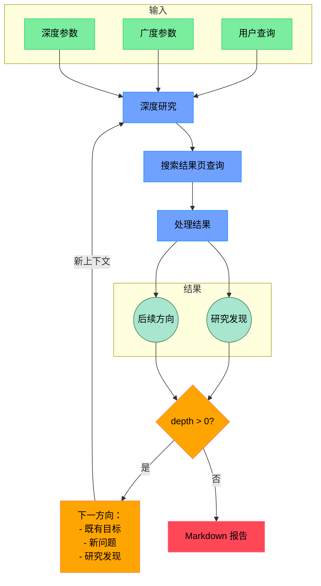

# Open Deep Research

> 中文翻译说明：本文译自 `dzhng/deep-research` 的 README。原文来源：https://github.com/dzhng/deep-research 。许可证：MIT License。代码块、链接和 Mermaid 图尽量保留原样，仅翻译说明文字。

一个由 AI 驱动的研究助手，通过结合搜索引擎、网页抓取和大语言模型，对任何主题执行迭代式、深入的研究。

这个仓库的目标，是提供一个最简单的 deep research agent 实现。例如，一个可以随着时间推移不断细化研究方向，并深入挖掘某个主题的 agent。目标是把仓库规模保持在 500 行代码以内，方便理解，也方便在它之上继续构建。

如果你喜欢这个项目，请考虑给它点 star，并在 [X/Twitter](https://x.com/dzhng) 上关注我。这个项目由 [Duet](https://duet.so) 创建。

## 工作原理



## 功能

- **迭代式研究**：通过反复生成搜索查询、处理结果，并基于发现继续深入，执行深度研究。
- **智能查询生成**：使用 LLM 根据研究目标和已有发现生成有针对性的搜索查询。
- **深度与广度控制**：通过可配置参数控制研究的广度（breadth）和深度（depth）。
- **智能追问**：生成追问问题，以便更好地理解研究需求。
- **完整报告**：生成包含发现和来源的详细 Markdown 报告。
- **并发处理**：并行处理多个搜索和结果处理任务，提高效率。

## 要求

- Node.js 环境
- API key：
  - Firecrawl API（用于网页搜索和内容提取）
  - OpenAI API（用于 o3 mini 模型）

## 设置

### Node.js

1. 克隆仓库。
2. 安装依赖：

```bash
npm install
```

3. 在 `.env.local` 文件中设置环境变量：

```bash
FIRECRAWL_KEY="your_firecrawl_key"
# If you want to use your self-hosted Firecrawl, add the following below:
# FIRECRAWL_BASE_URL="http://localhost:3002"

OPENAI_KEY="your_openai_key"
```

如果要使用本地 LLM，请注释掉 `OPENAI_KEY`，并改为取消注释 `OPENAI_ENDPOINT` 和 `OPENAI_MODEL`：

- 将 `OPENAI_ENDPOINT` 设置为本地服务器地址（例如 `"http://localhost:1234/v1"`）。
- 将 `OPENAI_MODEL` 设置为本地服务器中加载的模型名称。

### Docker

1. 克隆仓库。
2. 将 `.env.example` 重命名为 `.env.local`，并设置你的 API key。

3. 运行 `docker build -f Dockerfile`。

4. 运行 Docker 镜像：

```bash
docker compose up -d
```

5. 在 docker 服务中执行 `npm run docker`：

```bash
docker exec -it deep-research npm run docker
```

## 使用方式

运行研究助手：

```bash
npm start
```

系统会提示你：

1. 输入研究查询。
2. 指定研究广度（推荐：3-10，默认：4）。
3. 指定研究深度（推荐：1-5，默认：2）。
4. 回答追问问题，以细化研究方向。

随后系统会：

1. 生成并执行搜索查询。
2. 处理并分析搜索结果。
3. 基于发现递归地深入探索。
4. 生成一份完整的 Markdown 报告。

最终报告会根据你选择的模式，保存为工作目录中的 `report.md` 或 `answer.md`。

### 并发

如果你使用的是 Firecrawl 付费版本或本地版本，可以放心通过设置 `CONCURRENCY_LIMIT` 环境变量提高 `ConcurrencyLimit`，让运行速度更快。

如果你使用的是免费版本，有时可能会遇到限流错误；可以把限制降低到 1（但运行速度会慢很多）。

### DeepSeek R1

Deep research 在 R1 上表现很好。我们使用 [Fireworks](http://fireworks.ai) 作为 R1 模型的主要 provider。要使用 R1，只需设置 Fireworks API key：

```bash
FIREWORKS_KEY="api_key"
```

检测到这个 key 后，系统会自动切换为使用 R1，而不是 `o3-mini`。

### 自定义 endpoint 和模型

还有另外 2 个可选环境变量，可以让你调整 endpoint（用于 OpenRouter 或 Gemini 等其他 OpenAI 兼容 API），以及模型字符串。

```bash
OPENAI_ENDPOINT="custom_endpoint"
CUSTOM_MODEL="custom_model"
```

## 工作原理

1. **初始设置**

   - 接收用户查询和研究参数（广度与深度）。
   - 生成追问问题，以更好地理解研究需求。

2. **深度研究流程**

   - 基于研究目标生成多个 SERP 查询。
   - 处理搜索结果，提取关键发现。
   - 生成后续研究方向。

3. **递归探索**

   - 如果 depth > 0，就接收新的研究方向并继续探索。
   - 每一轮迭代都会基于之前的发现继续构建。
   - 持续维护研究目标和发现的上下文。

4. **报告生成**
   - 将所有发现汇编成一份完整的 Markdown 报告。
   - 包含所有来源和参考资料。
   - 以清晰、易读的格式组织信息。

## 社区实现

**Python**：https://github.com/Finance-LLMs/deep-research-python

## 许可证

MIT License - 可按需自由使用和修改。
