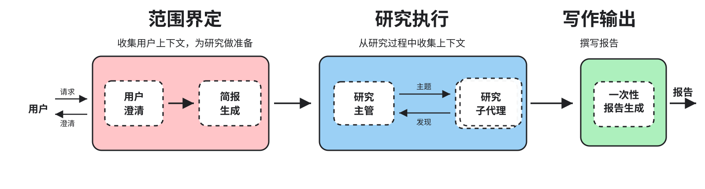
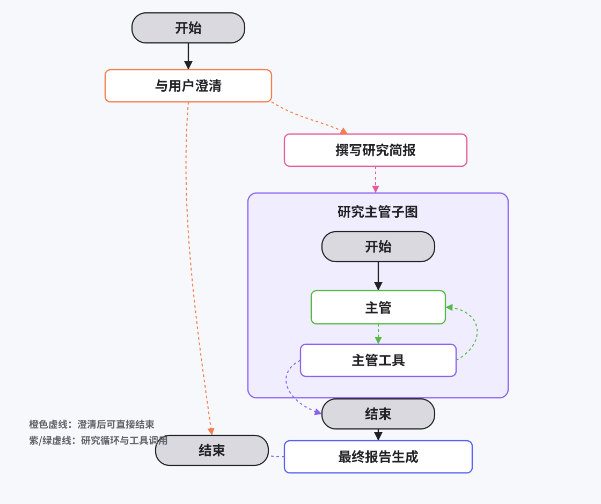

# Open Deep Research

> 中文翻译说明：本文译自 `langchain-ai/open_deep_research` 的 README。原文来源：https://github.com/langchain-ai/open_deep_research 。许可证：MIT License。代码块、链接和表格尽量保留原样；原 README 中的两张英文图片已重绘为中文本地 SVG。



Deep research 已经成为最受欢迎的 agent 应用之一。这是一个简单、可配置、完全开源的 deep research agent，可以跨多种模型 provider、搜索工具和 MCP server 工作。它的性能已经可以与许多流行的 deep research agent 相当（见 [Deep Research Bench leaderboard](https://huggingface.co/spaces/Ayanami0730/DeepResearch-Leaderboard)）。



### 最近更新

**2025 年 8 月 14 日**：查看我们关于构建 open deep research 的免费课程：[课程链接](https://academy.langchain.com/courses/deep-research-with-langgraph)，以及[课程仓库](https://github.com/langchain-ai/deep_research_from_scratch)。

**2025 年 8 月 7 日**：加入 GPT-5，并用 GPT-5 结果更新了 Deep Research Bench 评估。

**2025 年 8 月 2 日**：在 [Deep Research Bench Leaderboard](https://huggingface.co/spaces/Ayanami0730/DeepResearch-Leaderboard) 上以 0.4344 的总分取得第 6 名。

**2025 年 7 月 30 日**：阅读我们的[博客文章](https://rlancemartin.github.io/2025/07/30/bitter_lesson/)，了解从最初实现演进到当前版本的过程。

**2025 年 7 月 16 日**：阅读我们的[博客](https://blog.langchain.com/open-deep-research/)，并观看[视频](https://www.youtube.com/watch?v=agGiWUpxkhg)快速了解项目概况。

### 快速开始

1. 克隆仓库并激活虚拟环境：

```bash
git clone https://github.com/langchain-ai/open_deep_research.git
cd open_deep_research
uv venv
source .venv/bin/activate  # On Windows: .venv\Scripts\activate
```

2. 安装依赖：

```bash
uv sync
# or
uv pip install -r pyproject.toml
```

3. 设置 `.env` 文件，以自定义环境变量（用于模型选择、搜索工具和其他配置项）：

```bash
cp .env.example .env
```

4. 在本地用 LangGraph server 启动 agent：

```bash
# Install dependencies and start the LangGraph server
uvx --refresh --from "langgraph-cli[inmem]" --with-editable . --python 3.11 langgraph dev --allow-blocking
```

这会在浏览器中打开 LangGraph Studio UI。

```text
- API: http://127.0.0.1:2024
- Studio UI: https://smith.langchain.com/studio/?baseUrl=http://127.0.0.1:2024
- API Docs: http://127.0.0.1:2024/docs
```

在 `messages` 输入字段中提出问题，然后点击 `Submit`。你可以在 "Manage Assistants" 标签页中选择不同配置。

### 配置

#### LLM

Open Deep Research 通过 [init_chat_model() API](https://python.langchain.com/docs/how_to/chat_models_universal_init/) 支持广泛的 LLM provider。它会在几个不同任务中使用 LLM。更多细节可查看 [configuration.py](https://github.com/langchain-ai/open_deep_research/blob/main/src/open_deep_research/configuration.py) 文件中的模型字段。也可以通过 LangGraph Studio UI 访问这些配置。

- **Summarization**（默认：`openai:gpt-4.1-mini`）：总结搜索 API 结果。
- **Research**（默认：`openai:gpt-4.1`）：驱动搜索 agent。
- **Compression**（默认：`openai:gpt-4.1`）：压缩研究发现。
- **Final Report Model**（默认：`openai:gpt-4.1`）：撰写最终报告。

> 注意：所选模型需要支持 [structured outputs](https://python.langchain.com/docs/integrations/chat/) 和 [tool calling](https://python.langchain.com/docs/how_to/tool_calling/)。

> 注意：OpenRouter 请参考[这个指南](https://github.com/langchain-ai/open_deep_research/issues/75#issuecomment-2811472408)；通过 Ollama 使用本地模型，请查看[设置说明](https://github.com/langchain-ai/open_deep_research/issues/65#issuecomment-2743586318)。

#### Search API

Open Deep Research 支持广泛的搜索工具。默认使用 [Tavily](https://www.tavily.com/) search API。它完全兼容 MCP，并且可以使用 Anthropic 和 OpenAI 的原生 web search。更多细节可查看 [configuration.py](https://github.com/langchain-ai/open_deep_research/blob/main/src/open_deep_research/configuration.py) 文件中的 `search_api` 和 `mcp_config` 字段。也可以通过 LangGraph Studio UI 访问这些配置。

#### 其他

关于可自定义 Open Deep Research 行为的其他设置，请查看 [configuration.py](https://github.com/langchain-ai/open_deep_research/blob/main/src/open_deep_research/configuration.py) 中的字段。

### 评估

Open Deep Research 已配置为使用 [Deep Research Bench](https://huggingface.co/spaces/Ayanami0730/DeepResearch-Leaderboard) 进行评估。这个 benchmark 包含 100 个博士级研究任务（50 个英文、50 个中文），由 22 个领域的领域专家设计（例如 Science & Tech、Business & Finance），用于模拟真实世界中的 deep research 需求。它有 2 个评估指标，但 leaderboard 基于 RACE 分数。它使用 LLM-as-a-judge（Gemini），基于专家汇编的一组黄金报告和一组指标，对研究报告进行评估。

#### 使用方式

> 警告：根据模型选择不同，跑完整 100 个样例的成本可能约为 20-100 美元。

数据集可通过[这个 LangSmith 链接](https://smith.langchain.com/public/c5e7a6ad-fdba-478c-88e6-3a388459ce8b/d)获取。要启动评估，请运行以下命令：

```bash
# Run comprehensive evaluation on LangSmith datasets
python tests/run_evaluate.py
```

这会提供一个 LangSmith experiment 链接，名称为 `YOUR_EXPERIMENT_NAME`。完成后，将结果提取为可提交给 Deep Research Bench 的 JSONL 文件。

```bash
python tests/extract_langsmith_data.py --project-name "YOUR_EXPERIMENT_NAME" --model-name "you-model-name" --dataset-name "deep_research_bench"
```

这会创建符合所需格式的 `tests/expt_results/deep_research_bench_model-name.jsonl`。将生成的 JSONL 文件移动到 Deep Research Bench 仓库的本地 clone 中，并按照它们的 [Quick Start guide](https://github.com/Ayanami0730/deep_research_bench?tab=readme-ov-file#quick-start) 提交评估。

#### 结果

| 名称 | Commit | Summarization | Research | Compression | 总成本 | 总 token | RACE Score | Experiment |
|------|--------|---------------|----------|-------------|--------|----------|------------|------------|
| GPT-5 | [ca3951d](https://github.com/langchain-ai/open_deep_research/pull/168/commits) | openai:gpt-4.1-mini | openai:gpt-5 | openai:gpt-4.1 |  | 204,640,896 | 0.4943 | [Link](https://smith.langchain.com/o/ebbaf2eb-769b-4505-aca2-d11de10372a4/datasets/6e4766ca-613c-4bda-8bde-f64f0422bbf3/compare?selectedSessions=4d5941c8-69ce-4f3d-8b3e-e3c99dfbd4cc&baseline=undefined) |
| Defaults | [6532a41](https://github.com/langchain-ai/open_deep_research/commit/6532a4176a93cc9bb2102b3d825dcefa560c85d9) | openai:gpt-4.1-mini | openai:gpt-4.1 | openai:gpt-4.1 | $45.98 | 58,015,332 | 0.4309 | [Link](https://smith.langchain.com/o/ebbaf2eb-769b-4505-aca2-d11de10372a4/datasets/6e4766ca-6[…]ons=cf4355d7-6347-47e2-a774-484f290e79bc&baseline=undefined) |
| Claude Sonnet 4 | [f877ea9](https://github.com/langchain-ai/open_deep_research/pull/163/commits/f877ea93641680879c420ea991e998b47aab9bcc) | openai:gpt-4.1-mini | anthropic:claude-sonnet-4-20250514 | openai:gpt-4.1 | $187.09 | 138,917,050 | 0.4401 | [Link](https://smith.langchain.com/o/ebbaf2eb-769b-4505-aca2-d11de10372a4/datasets/6e4766ca-6[…]ons=04f6002d-6080-4759-bcf5-9a52e57449ea&baseline=undefined) |
| Deep Research Bench Submission | [c0a160b](https://github.com/langchain-ai/open_deep_research/commit/c0a160b57a9b5ecd4b8217c3811a14d8eff97f72) | openai:gpt-4.1-nano | openai:gpt-4.1 | openai:gpt-4.1 | $87.83 | 207,005,549 | 0.4344 | [Link](https://smith.langchain.com/o/ebbaf2eb-769b-4505-aca2-d11de10372a4/datasets/6e4766ca-6[…]ons=e6647f74-ad2f-4cb9-887e-acb38b5f73c0&baseline=undefined) |

### 部署和使用

#### LangGraph Studio

按照[快速开始](#快速开始)启动本地 LangGraph server，并在 LangGraph Studio 中测试 agent。

#### 托管部署

你可以轻松部署到 [LangGraph Platform](https://langchain-ai.github.io/langgraph/concepts/#deployment-options)。

#### Open Agent Platform

Open Agent Platform（OAP）是一个 UI，非技术用户可以用它构建和配置自己的 agent。OAP 很适合让用户用不同的 MCP 工具和 search API 配置 Deep Researcher，使其适配他们的需求和想解决的问题。

我们已经将 Open Deep Research 部署到了 OAP 的公开 demo 实例中。你只需要添加自己的 API key，就可以亲自测试 Deep Researcher。可以在[这里](https://oap.langchain.com)试用。

你也可以部署自己的 OAP 实例，并把你自己的自定义 agent（例如 Deep Researcher）提供给用户。

1. [Deploy Open Agent Platform](https://docs.oap.langchain.com/quickstart)
2. [Add Deep Researcher to OAP](https://docs.oap.langchain.com/setup/agents)

### 历史实现

`src/legacy/` 文件夹包含两个较早的实现，提供了自动化研究的替代方案。它们的性能不如当前实现，但可以帮助理解 deep research 的不同做法。

#### 1. Workflow Implementation（`legacy/graph.py`）

- **Plan-and-Execute**：带有人类参与规划的结构化 workflow。
- **Sequential Processing**：带 reflection 地逐节创建内容。
- **Interactive Control**：允许对报告计划进行反馈和批准。
- **Quality Focused**：强调通过迭代式 refinement 提高准确性。

#### 2. Multi-Agent Implementation（`legacy/multi_agent.py`）

- **Supervisor-Researcher Architecture**：协调式 multi-agent 系统。
- **Parallel Processing**：多个 researcher 同时工作。
- **Speed Optimized**：通过并发更快生成报告。
- **MCP Support**：广泛支持 Model Context Protocol。
