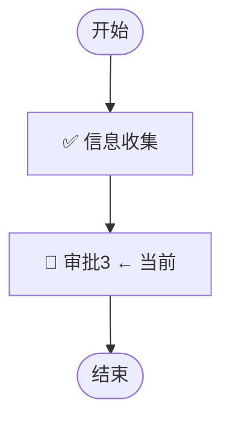

# query-instance-detail — 查询流程单详情

## 功能说明

获取指定流程单的完整信息，**先呈现全局视图帮用户建立整体概念，再聚焦进行中的任务**。属于**展示类操作**。

展示顺序：全局流程图 → 任务列表概览 → 进行中任务聚焦 → 已提交字段（按需）

## MCP 工具

| MCP Server | 工具名 |
|------------|--------|
| `huijin-workflow` | `DescribeWorkflowInstance` |
| `huijin-workflow` | `GetInstanceTaskList` |

> ⚠️ 调用前必须先 `mcp_get_tool_description` 获取参数 schema。两个接口可并行调用。

---

## 请求参数

### DescribeWorkflowInstance

| 参数 | 类型 | 必填 | 说明 |
|------|------|------|------|
| Id | string | ✅ | 流程单 ID（以 T 开头） |

### GetInstanceTaskList

| 参数 | 类型 | 必填 | 说明 |
|------|------|------|------|
| InstanceId | string | ✅ | 流程单 ID（以 T 开头） |

---

## 标准调用流程

```
Step 1: mcp_get_tool_description（并行获取两个工具描述）
        → [["huijin-workflow","DescribeWorkflowInstance"],["huijin-workflow","GetInstanceTaskList"]]
Step 2: 并行调用两个接口（结果不互相依赖）
        mcp_call_tool DescribeWorkflowInstance → { "Id": "<InstanceId>" }
        mcp_call_tool GetInstanceTaskList      → { "InstanceId": "<InstanceId>" }
Step 3: 按优先级整合渲染结果（见下方展示结构）
```

---

## 展示结构（优先级顺序）

展示时按以下**优先级顺序**组织内容，先全局再聚焦：

### 第一部分：📄 基本信息 + 🔀 流程进度图（全局视图）

先展示基本信息表，然后用 **Mermaid 流程图** 呈现整个流程单的节点流转全貌，让用户一目了然当前走到了哪里。

```markdown
## 📄 流程单详情：{Title}

### 📄 基本信息

| 字段 | 值 |
|------|----|
| 流程单ID | `{Id}` |
| 整体状态 | {Status_Emoji} |
| 发起人 | {Creator} |
| 发起时间 | {CreateTime} |
| 总耗时 | {CostTime 格式化} |
| 所属流程 | {WorkflowName}（{WorkflowId}） |
| 管理员 | {Managers} |
```

**🔀 流程进度图**：

从 `GetInstanceTaskList` 返回的任务列表和 `DescribeWorkflowInstance` 的 `SeqFlowList`（流转信息），绘制 Mermaid 流程图，**标注每个节点的当前状态**：

````markdown
### 🔀 流程进度图


````

**Mermaid 流程图规则**：
- 已完成节点：`[✅ {NodeName}]`
- 进行中节点：`[🔄 {NodeName} ← 当前]`（加粗高亮）
- 待激活节点：`[⏳ {NodeName}]`
- 已驳回/已撤单终止的节点：`[❌ {NodeName}]`
- 如果流程包含并行分支（从 SeqFlowList 可识别），用分支结构展示
- 如果节点少于等于 5 个，也可用简化文字箭头：`开始 → ✅信息收集 → 🔄审批3(当前) → ⏳结束`

---

### 第二部分：📋 任务列表概览（全局列表）

以 Markdown 表格形式展示所有节点的概览列表，让用户一眼看到全局进展：

```markdown
### 📋 任务节点概览

| # | 节点名称 | 类型 | 状态 | 处理人 | 耗时 |
|---|---------|------|------|--------|------|
| 1 | 信息收集 | 📋 收集 | ✅ 已完成 | ritarqwang | 9秒 |
| 2 | **审批3** | 🔵 审批 | **🔄 进行中** | **ritarqwang, jamesye** | **8天22小时** |
```

**表格规则**：
- 进行中的节点行加粗显示
- 已完成节点展示：处理人 + 耗时
- 进行中节点展示：当前处理人 + 已等待时长
- 待激活节点展示：处理人为「—」，耗时为「—」

---

### 第三部分：⚡ 进行中的任务（聚焦详情）

从任务列表中筛选 `Status = "Running"` 的节点，**展开展示详细信息**：

```markdown
### ⚡ 进行中的任务

**{TaskName}** · 🔵 {TaskType展示} · 🔄 进行中

| 字段 | 值 |
|------|----|
| 节点开始时间 | {CreateTime} |
| 已停留 | ⏱️ {格式化时长}（如：2天6小时30分钟） |
| 当前处理人 | {HandleList[].Handler，逗号分隔} |
| 审批方式 | {or=或签 / and=会签} |
```

> 如有多个进行中节点（并行审批场景），逐个展示。

---

### 第四部分：📋 已提交字段信息（按需展示）

**默认不直接展示全部字段**，而是主动询问用户是否需要查看：

```markdown
### 📋 已提交的字段信息

该流程单共提交了 {字段数量} 个字段。需要我帮你查看吗？
- 输入「查看全部字段」展示所有已提交的信息
- 或告诉我你想查看的具体字段名，我帮你精准提取
```

**当用户要求查看时**，从 `DescribeWorkflowInstance` 的 `InputParams` 字段解析：

- **用户说「查看全部」**→ 展示所有字段的 key-value 表格
- **用户说「查看某个字段」**→ 仅展示匹配的字段信息（按字段 Name 或 Key 模糊匹配）

```markdown
| 字段名 | 值 |
|-------|----|
| {参数 Name/Key} | {参数值} |
```

**解析规则**：
- `InputParams` 是 JSON 字符串，必须解析后提取
- 枚举类型展示 Label 而非 Value
- 空值展示 `—`
- 数组值展示为逗号分隔

---

## 状态映射

| 状态值 | 展示 |
|--------|------|
| `Running` | 🔄 进行中 |
| `Succeed` | ✅ 已完成 |
| `Failed` | ❌ 已驳回 |
| `Revoked` | ↩️ 已撤单 |
| `Pending` | ⏳ 待激活 |

## 节点类型映射

| TaskType | 展示 |
|----------|------|
| `approve` | 🔵 审批节点 |
| `notify` | 📢 通知节点 |
| `execute` | ⚙️ 执行节点 |
| `collect` | 📋 收集节点 |
| `code` | ⚙️ 代码节点 |

## 时间格式化规则

| 耗时范围 | 展示格式 |
|---------|---------|
| < 60 秒 | `{n}秒` |
| < 60 分钟 | `{n}分钟` |
| < 24 小时 | `{n}小时{m}分钟` |
| ≥ 24 小时 | `{n}天{m}小时` |

---

## 展示模板

使用 @templates/instance-detail.md 整合渲染结果。

---

## 输出规范

所有回答的**最后**均附上数据来源声明，链接精准到当前查看的流程单：

```markdown
> 以上数据均来自流程平台（https://huijin.woa.com/flow/apply/detail/{InstanceId}）
```

例如：`> 以上数据均来自流程平台（https://huijin.woa.com/flow/apply/detail/T2026052500004163）`

---

## 注意事项

- 如果用户未提供流程单 ID（T 开头），引导用户先通过 `query-todo-instances` 或 `query-my-instances` 查询列表后选择
- `InputParams` 返回的是 JSON 字符串，必须解析为结构化格式，不得原样输出
- 两个接口可并行调用，提高响应速度
- **流程进度图的节点顺序**：按 `GetInstanceTaskList` 返回的 List 顺序排列，结合 `SeqFlowList` 确定连线关系
- **如果流程单已结束**（无进行中任务），流程图中所有节点标记为 ✅，第三部分展示为「✅ 所有任务已完成，流程已结束」
- **如果流程单已撤单/驳回**，流程图中标记终止节点为 ❌，第三部分展示终止原因和最后处理节点

---

## 参考资料

- 状态枚举说明：参考 @references/status-enum.md
