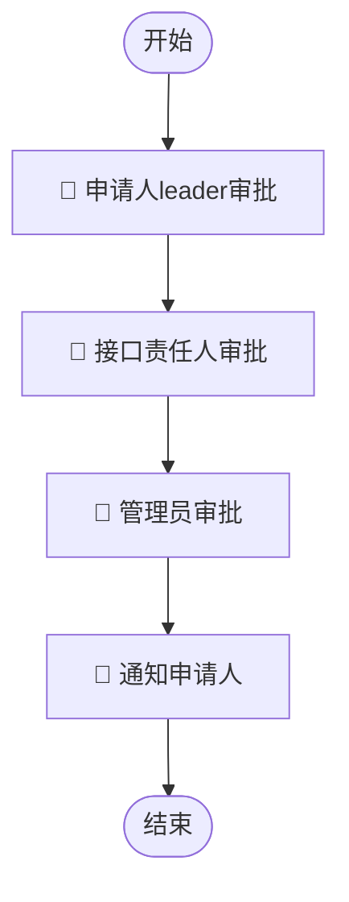
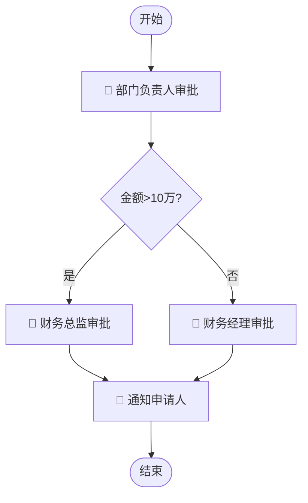

# query-workflow-detail — 查看流程画布详情

## 功能说明

获取指定流程图纸的完整定义，以**有条理的 Markdown 形式**展示整个流程框架，帮助用户理解流程的节点流转结构、输入参数要求。属于**展示类操作**。

## MCP 工具

| MCP Server | 工具名 |
|------------|--------|
| `huijin-workflow` | `DescribeWorkflow` |

> ⚠️ 调用前必须先 `mcp_get_tool_description` 获取参数 schema。

---

## 请求参数

| 参数 | 类型 | 必填 | 说明 |
|------|------|------|------|
| Id | string | 条件必填 | 流程图纸 ID（以 P 开头）；Id 和 InstanceId 二选一 |
| InstanceId | string | 条件必填 | 通过流程单 ID（以 T 开头）反查图纸 |
| IsLatest | boolean | 否 | 是否查询最新版本，默认 true |
| PublishVersion | number | 否 | 查询指定发布版本号 |
| NeedConfig | string | 否 | 是否需要返回完整图纸配置（`true`/`false`） |

---

## 标准调用流程

```
Step 1: 确认用户提供了流程 ID（P 开头）或流程单 ID（T 开头）
        - 如未提供，先调用 query-workflow-list 让用户选择
Step 2: mcp_get_tool_description → [["huijin-workflow", "DescribeWorkflow"]]
Step 3: mcp_call_tool DescribeWorkflow → { "Id": "<WorkflowId>", "IsLatest": true, "NeedConfig": "true" }
Step 4: 使用展示模板 @templates/workflow-detail.md 渲染结果
```

---

## 展示结构（优先级顺序）

### 第一部分：📋 流程概览

以简洁表格展示流程基本信息。

### 第二部分：🔀 流程框架图（重点）

**用 Markdown 的 Mermaid 流程图描述整个流程的节点流转结构**，帮助用户一目了然理解流程走向。

规则：
- 从 `WorkflowConfig` 中解析节点和连线信息
- 使用 Mermaid `graph TD`（从上到下）或 `graph LR`（从左到右，节点较多时使用）
- 节点标注类型图标：🔵审批 / 📢通知 / ⚙️执行
- 条件分支用菱形节点表示
- 如果流程较简单（≤5 个节点），使用文字箭头描述即可：`开始 → 节点A → 节点B → 结束`

**Mermaid 流程图格式**：

````markdown

````

**当流程包含条件分支时**：

````markdown

````

**如果无法解析 WorkflowConfig**（NeedConfig 未返回或解析失败），使用简化文字描述：

```markdown
### 🔀 流程框架

开始 → {节点1名称}（🔵审批）→ {节点2名称}（🔵审批）→ {节点3名称}（📢通知）→ 结束

共 {N} 个审批/通知/执行节点。
```

### 第三部分：📝 输入参数定义

展示发起该流程时需要填写的参数表。

### 第四部分：👥 管理员信息

展示流程管理员列表。

---

## 展示模板

使用 @templates/workflow-detail.md 渲染结果。

---

## 输出规范

所有回答的**最后**均附上数据来源声明，链接精准到当前查看的流程：

```markdown
> 以上数据均来自流程平台（https://huijin.woa.com/flow/detail/{WorkflowId}）
```

例如：`> 以上数据均来自流程平台（https://huijin.woa.com/flow/detail/P2026040900000919）`

---

## 注意事项

- 如果用户未提供流程 ID，先通过 `query-workflow-list` 让用户选择
- `InputParams` 返回的是 JSON 字符串，必须解析后按结构化格式展示
- `WorkflowConfig` 返回的是 JSON 字符串，解析其中的节点（nodes）和连线（edges）生成流程图
- 流程图应优先使用 Mermaid 格式，如果节点超过 15 个，考虑分段展示或使用简化文字描述
- 条件分支（ConditionExpression 不为空的连线）需要在图中标注条件

---

## 参考资料

- 节点类型映射参考 @references/status-enum.md 中的 TaskType 部分
